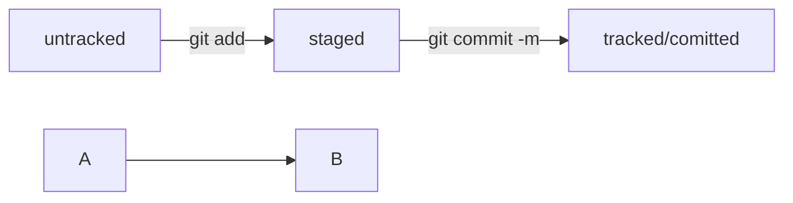

# Мой первый проект
---
## Не знаю о чём он
---
### И к чему он приведёт

```mermaid
graph LR;
  untracked -- "git add" --> staged;
  staged    -- "git commit -m"     --> tracked/comitted;

%% стрелка без текста для примера: 
  A --> B;
```
